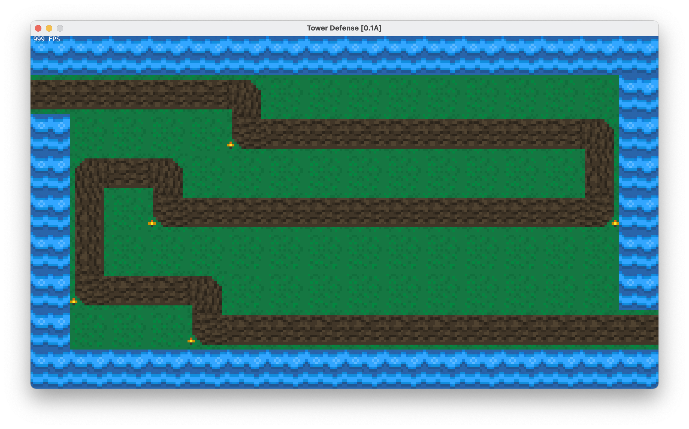

# Tower Defense
My first capstone Java program that I made in 2016 while I was in high school. Not a fully functioning game. Features include:
* Dynamic sprite rendering
* User made maps (look at e_test/ folder)
* Built in game engine and graphics rendering

Probably not the most efficient code you'll see, but it was good times :P Presented this with the CS class huddled around my school computer

# Screenshot
